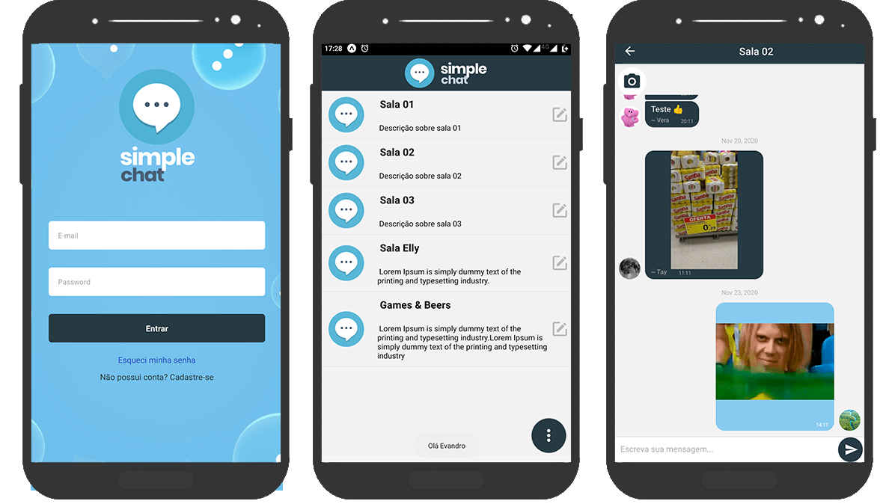

<p align="center">
    
</p>




## Descrição
O app Simple Chat tem como objetivo possibilitar conversas em salas de bate papo. Conta com as seguintes funcionalidades:
- Registro de usuários
- Edição de perfil com upload de foto
- Login
- Cadastro e edição de salas
- Chat com envio de imagens/gifs

## Como executar o projeto
```
expo start
```

## Tecnologias
- [Expo](https://expo.io/)
- [React](https://pt-br.reactjs.org/)
- [React Native](https://reactnative.dev/)
- [Expo ImagePicker](https://docs.expo.io/versions/latest/sdk/imagepicker/)
- [Permissions](https://docs.expo.io/versions/latest/sdk/permissions/)
- [Firebase](https://rnfirebase.io/)
- [React Native Easy Grid](https://www.npmjs.com/package/react-native-easy-grid)
- [Cloud Storage (react-native-firebase-upload)](https://rnfirebase.io/storage/usage)
- [Gifted Chat](https://github.com/FaridSafi/react-native-gifted-chat)
- [ImageModal](https://www.npmjs.com/package/react-native-image-modal)
